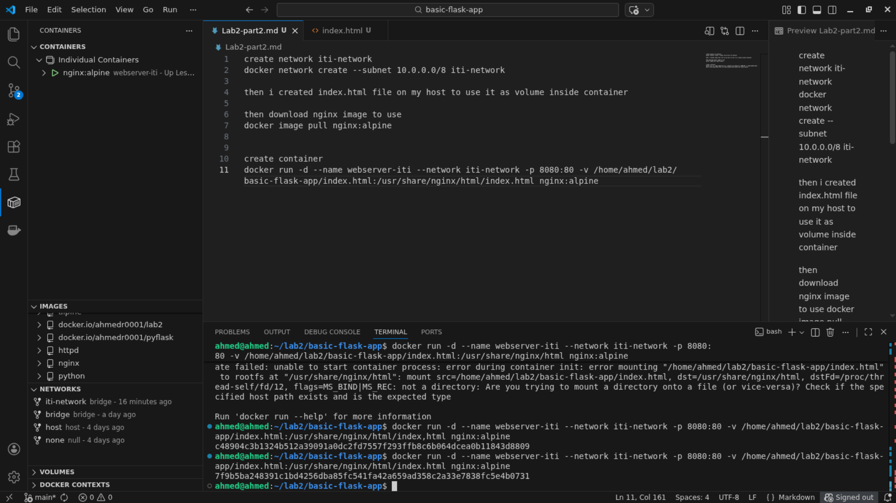

# ITI Docker Lab2 part 2

create network iti-network
```bash
docker network create --subnet 10.0.0.0/8 iti-network
```

then i created `index.html` file on my host to use it as volume inside container 

then download nginx image to use 
```bash
docker image pull nginx:alpine
```


create container 
```bash
docker run -d --name webserver-iti --network iti-network -p 8080:80 -v /home/ahmed/lab2/basic-flask-app/index.html:/usr/share/nginx/html/index.html nginx:alpine
```

